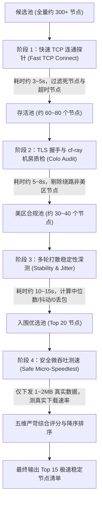

# 架构设计方案：Cloudflare 节点四阶漏斗严选引擎与多维质量评估模型

> **维护者**：JeffSmith  
> **日期**：2026-10-09  
> **状态**：已批准 (Approved)  
> **目标工程**：`D:\nice_wall\ipselect`  
> **核心实现**：`scripts/filter_us_nodes.py`

---

## 一、 背景与动因 (Background & Motivation)

在现有的自动化优选体系中，自动化脚本通过定时探测生成美区专属节点列表（如 `best_us.txt`、`home_us_best_node.txt`），供 `WorkerVless2sub` 及下游客户端（OpenClash / v2rayN）拉取使用。

然而，在实际使用过程中发现，**当前评估出的节点质量仍不尽人意**，主要症结在于：
1. **虚假/静态速率（Mock Speed）**：当前脚本要么直接复用历史静态 CSV 中的陈旧测速记录，要么通过经验公式 `3800.0 / avg_rtt` 虚构速率，从未发生过任何实际网络数据流下行吞吐测试。
2. **延迟与抖动判定过于宽松（“人人满分”）**：当前模型规定 `avg_rtt < 500ms` 即给满分 2.5 分，导致优质美西线路（~180ms）与极差绕路（~480ms）无法区分；总分扎堆在 8.5~9.8 分，排序失去区分度。
3. **采样时间窗口过窄**：仅在极短毫秒内连续发送 4 轮小包请求，无法识别网络抖动与偶发丢包。
4. **忽视 Cloudflare Anycast 边缘物理机房落地（Colo POP）**：Anycast IP 受运营商 BGP 路由影响，可能被绕路分流至欧洲（FRA、LHR）甚至亚洲非目标机房，未对 `cf-ray` 响应头进行机房质检。
5. **官方限流风险**：若采用传统大文件全量跑满测速，会瞬间触发 Cloudflare 边缘的速率限制（HTTP 429 / 阻断），必须在“真实测速”与“防封控”之间取得工程平衡。

---

## 二、 系统架构与四阶漏斗执行流水线 (4-Stage Funnel Pipeline)

为了在兼顾高并发探测效率、极低资源占用（兼容 OpenWrt/iStoreOS 软路由）、安全避开 Cloudflare 速率限制的同时获得真实的节点体验质量，设计**四阶由粗到细的漏斗探测流水线**：



### 1. 阶段 1：快速 TCP 连通探针 (Fast Connect Probe)
* **目标**：在数秒内并发淘汰大部分关机、下线、被 GFW 阻断的死节点。
* **参数配置**：
  * 超时时间：`TIMEOUT = 0.8s`；
  * 并发线程：`WORKERS = 30`；
* **逻辑**：仅尝试 TCP 三次握手建立，建立成功立即关闭 socket，产出存活 IP 池（预计保留 20%~30%）。

### 2. 阶段 2：TLS 握手与 `cf-ray` 机房质检 (Colo Audit)
* **目标**：建立 TLS 安全连接，并验证 Cloudflare 边缘服务器真实落地的物理机房代码。
* **参数配置**：
  * SNI 域名：`proxy.19940407.xyz`；
  * 目标请求：轻量 HTTP `HEAD /cdn-cgi/trace` 或 `HEAD /`；
* **机房白名单匹配**：
  * 从响应头 `cf-ray`（例如 `cf-ray: 8d29b12e3f4a-SJC`）中提取末尾三位大写机房代号；
  * 美西核心机房优先集合：`{'SJC', 'LAX', 'SFO', 'SEA', 'PDX', 'SLC', 'PHX', 'LAS'}`；
  * 美国其他核心骨干机房集合：`{'DFW', 'ORD', 'IAD', 'ATL', 'MIA', 'EWR', 'JFK', 'DEN', 'IAH', 'BOS', 'MSP', 'DTW', 'CLT'}`；
  * 若解析出的机房属于欧洲（如 FRA, AMS, LHR）或非美国机房，直接予以淘汰。

### 3. 阶段 3：多轮打散稳定性与抖动深度测试 (Multi-round Stability Probe)
* **目标**：扩大采样时间窗口，杜绝偶发丢包与瞬间网络抖动。
* **测试方法**：
  * 连续执行 6 轮探测；
  * 轮次之间注入 50~100ms 随机微休眠，打散并发脉冲；
  * 统计成功轮次 `success_count`，计算真实丢包率 `loss_rate`；
  * 计算延迟中位数 `median_rtt` 与延迟极差/抖动 `jitter = max(rtts) - min(rtts)`；
* **准入门槛**：
  * 实行 **0 丢包硬门槛**：6 轮中只要丢包 $\ge 2$ 次，直接在此阶段淘汰，不进入昂贵的测速阶段；仅允许前 20 名最具稳定性的节点入围阶段 4。

### 4. 阶段 4：安全微吞吐测速 (Safe Micro-Speedtest)
* **目标**：测出真实的下载带宽（MB/s），且 100% 避免触发 Cloudflare 官方速率限制（Rate Limit / 429）。
* **测试方法**：
  * 仅对入围的 Top 20 节点发起单线程串行/小并发测速；
  * 请求 Cloudflare 静态测速数据流：`https://proxy.19940407.xyz/__down?bytes=1572864`（精准 1.5MB 数据块）或 `speed.cloudflare.com` 静态资源；
  * 建立长连接并实时读取数据流，设定最大抓取时间为 2.0 秒（达到 1.5MB 或超时立即截断并断开连接）；
  * 真实速率计算公式：
    $$\text{Real Speed (MB/s)} = \frac{\text{Received Bytes}}{1024 \times 1024 \times \Delta t_{\text{seconds}}}$$
  * 单节点耗费流量仅 1.5MB，整个流程总消耗流量不超过 30MB，极度环保且安全。

---

## 三、 严苛数学评分模型 (Mathematical Scoring Model)

新模型采用 **1.0 ~ 10.0 分制**，重构各指标权重占比，建立陡峭梯度以拉开区分度：

$$\text{Final Score} = S_{\text{稳定度}} + S_{\text{真实测速}} + S_{\text{真实延迟}} + S_{\text{抖动平稳}} + \Delta_{\text{机房奖惩}}$$

### 1. 真实微吞吐速度分 $S_{\text{真实测速}}$（满分 3.5 分，核心区分项）
* $\ge 8.0\text{ MB/s}$（极品带宽）：满分 **3.5 分**
* $4.0 \sim 8.0\text{ MB/s}$：$2.5 + \frac{\text{speed} - 4.0}{4.0} \times 1.0$（**2.5 ~ 3.5 分**）
* $1.5 \sim 4.0\text{ MB/s}$：$1.5 + \frac{\text{speed} - 1.5}{2.5} \times 1.0$（**1.5 ~ 2.5 分**）
* $0.5 \sim 1.5\text{ MB/s}$：$0.5 + \frac{\text{speed} - 0.5}{1.0} \times 1.0$（**0.5 ~ 1.5 分**）
* $< 0.5\text{ MB/s}$：**0.1 ~ 0.5 分**

### 2. 真实延迟中位数分 $S_{\text{真实延迟}}$（满分 2.5 分，以中美骨干网实际物理瓶颈为基准）
* $\le 185\text{ ms}$（顶级直连美西）：满分 **2.5 分**
* $185 \sim 230\text{ ms}$（优质美西）：$2.5 - \frac{RTT - 185}{45} \times 0.7$（**1.8 ~ 2.5 分**）
* $230 \sim 280\text{ ms}$（普通跨洋）：$1.8 - \frac{RTT - 230}{50} \times 0.8$（**1.0 ~ 1.8 分**）
* $280 \sim 350\text{ ms}$（高延迟）：$1.0 - \frac{RTT - 280}{70} \times 0.8$（**0.2 ~ 1.0 分**）
* $> 350\text{ ms}$（严重绕路）：**0.0 分**

### 3. 基础稳定性分 $S_{\text{稳定度}}$（满分 3.0 分，0 丢包硬门槛）
* 6 轮测试 0% 丢包（6/6 全通）：**3.0 分**
* 丢包 1 次（5/6 通）：**1.0 分**
* 丢包 $\ge 2$ 次：**0.0 分**

### 4. 抖动平稳度分 $S_{\text{抖动平稳}}$（满分 1.0 分）
* 抖动 $\le 40\text{ ms}$：满分 **1.0 分**
* $40 \sim 120\text{ ms}$：$1.0 - \frac{Jitter - 40}{80} \times 0.6$（**0.4 ~ 1.0 分**）
* $> 120\text{ ms}$：**0.1 ~ 0.4 分**

### 5. 机房与官方加成 $\Delta_{\text{机房奖惩}}$
* 命中美西核心优选机房（`SJC`, `LAX`, `SEA`, `SFO`）：奖励 **+0.5 分**（总分上限封顶 10.0 分）；
* 非 Cloudflare 官方 Anycast 网段：扣减 **2.0 分**。

---

## 四、 异常处理、容灾降级与环境兼容 (Resilience & Compatibility)

1. **测速降级处理**：
   * 若测速过程中遇到 HTTP 429 或连接中断，捕获异常并不中断主流程，平滑降级（以该节点的前置 TTFB 转换为保底估算分），保证节点评估不中断。
2. **软路由网络环境 100% 兼容**：
   * 保留 `init_network_bypass` 中的 `os.setgid(65534)` 机制（Linux nogroup 免除 OpenClash 劫持）与 `--interface` 网卡绑定功能；
   * 坚持使用 Python 3 标准库（`socket`, `ssl`, `urllib`, `concurrent.futures`, `ipaddress`），无需在嵌入式 iStoreOS 路由器上安装任何第三方轮子。
3. **输出契约无缝兼容与网络环境自动识别 (Auto Environment Detection)**：
   * **环境自动感知**：
     * 若本地 IP 属于 `192.168.0.x`（家庭网段）：自动识别为 **家庭**，默认输出到 `home_us_best_node.txt`，命名后缀为 `-家庭`；
     * 若本地 IP 属于 `10.10.18.x`（公司网段）：自动识别为 **公司**，默认输出到 `best_us.txt`，命名后缀为 `-公司`；
     * 若指定了 CLI 参数 `--tag` 或 `--output`，则允许显式覆盖。
   * **输出命名保持一致**：
     ```text
     104.17.147.243:8443#US-DaTree-9.4-01-公司 5.82MB/s
     198.41.206.45:443#US-DaTree-8.9-01-家庭 2.85MB/s
     ```
   * 与下游 `WorkerVless2sub` 和 OpenClash 的解析器保持 100% 兼容。

---

## 五、 实施计划 (Implementation Outline)

1. 重构 `scripts/filter_us_nodes.py`，实现阶段 1（快速 TCP）、阶段 2（`cf-ray` 机房质检）、阶段 3（6 轮打散稳定性测试）、阶段 4（微吞吐安全测速）；
2. 升级评分算法与排序策略；
3. 本地运行测速验证，检验日志输出中的真实机房代号、真实速度与严苛评分表现；
4. 验证生成的 `best_us.txt` 格式与下游消费兼容性。
