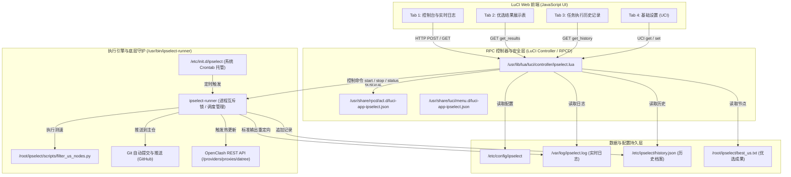

# iStoreOS 节点优选控制台插件 (luci-app-ipselect) 设计规范

> **文档版本**：v1.0.0  
> **创建日期**：2026-10-10  
> **作者/维护者**：JeffSmith  
> **适用目标**：iStoreOS 25+ / OpenWrt 21+ 路由操作系统 (x86_64 及其他架构)  
> **核心组件**：LuCI JavaScript 视图、LuCI Controller RPC、UCI 配置子系统、ipselect-runner 执行守护程序、OpenClash REST 联动

---

## 1. 概述与设计背景

### 1.1 问题现状
在现有的 Cloudflare 节点优选运维流程中，软路由（如公司环境 `10.10.18.2`、家庭环境 `192.168.0.3`）通过后台定时脚本（`/root/ipselect/auto_update_nodes.sh`）或通过 SSH 登录终端手动执行测速筛选。这种方式存在以下痛点：
1. **交互门槛高**：每次需要即时触发优选时，必须通过 SSH 连接软路由并运行命令，体验繁琐；
2. **缺乏可视化反馈**：无法直观查看当前正在执行的测速进度与实时日志；
3. **优选结果不可见**：测速生成的优选节点（如 `best_us.txt`、`home_us_best_node.txt`）以及延迟、下载带宽等关键质量指标缺乏图形化表格展示；
4. **历史执行无追溯**：缺乏历史任务简报，无法快速获知上次执行时间、耗时、Git 仓库推送是否成功、OpenClash 是否已刷新；
5. **多设备复用困难**：公司与家庭多台设备之间缺乏标准的插件化安装包。

### 1.2 设计目标
构建一套符合 iStoreOS / OpenWrt 官方技术规范的 Web 交互插件 **`luci-app-ipselect`**：
- **服务菜单集成**：无缝内嵌于 iStoreOS **【服务】 $\rightarrow$ 【节点优选】**；
- **一键即时触发**：支持在 UI 界面一键启动/中止测速，前端免刷新实时滚动输出执行日志；
- **优选结果直观呈现**：解析并表格化展示最新的 Top 15 优选节点明细（IP、端口、机房备注、延迟、速度），支持一键复制与下载；
- **历史执行档案**：记录最近 10 次执行记录（触发类型、耗时、状态、节点数、Git 推仓状态、OpenClash 联动状态），支持回溯历史日志；
- **系统生态联动**：测速推仓成功后，可自动触发 OpenClash 订阅提供商（Proxy Provider）热重载与健康检查；
- **标准工程交付**：生成标准的 `.ipk` 单包，支持在不同 iStoreOS 设备间一键安装与迁移。

---

## 2. 总体架构设计

系统划分为 **LuCI Web 前端**、**RPC 控制器与安全层**、**执行引擎与系统底层** 三大层次：



---

## 3. 前端 UI 与交互设计

### 3.1 页面全局仪表盘 (Dashboard Header)
进入页面顶部展示当前运行状态卡片：
- **运行状态指示灯**：
  - `🟢 空闲 (Idle)`
  - `🔄 正在优选测速中 (PID: xxxx, 运行时长: 45s)`
  - `🔴 上次执行异常`
- **关键运行摘要**：
  - 当前运行环境：`公司 (best_us.txt)` / `家庭 (home_us_best_node.txt)`
  - 最近一次测速完成时间；
  - 最近一次 Git 推送状态；
  - 最近一次 OpenClash 联动刷新状态。

### 3.2 选项卡功能细分

#### Tab 1: 控制台与实时日志 (Console & Live Logs)
- **操作按钮组**：
  - `【立即开始优选】`：发送 `start` 请求。任务启动后按钮呈现 Loading 动画并置灰禁用；
  - `【终止当前任务】`：若任务在执行中，该按钮点亮为红色危险按钮，点击后二次确认并发送 `stop` 中断当前任务；
  - `【清空日志】`：清空当前控制台显示及磁盘缓冲日志；
- **控制台窗口**：
  - 黑色背景（Monaco / Consolas 字体），高度自适应（约 450px）；
  - 任务运行期间，前端定时器以 1.5 秒间隔调用 `get_log` 增量拉取日志并自动滚屏到底部；
  - 任务执行完毕后，弹出 LuCI 原生 Toast 通知提示执行结果，轮询自动停止。

#### Tab 2: 优选结果展示 (Selection Results)
- **统计信息栏**：当前节点文件路径、生成时间、有效节点数量（通常为 Top 15）；
- **节点表格 (Data Table)**：
  | 序号 | 节点 IP | 端口 | 节点类型/备注 | 延迟 (ms) | 测速带宽 (MB/s) | 状态 |
  | :--- | :--- | :--- | :--- | :--- | :--- | :--- |
  | 1 | `104.16.89.201` | `443` | 公司-CF官方-SJC | 165ms | 18.5 MB/s | 🟢 优选 |
  | 2 | `162.158.21.45` | `443` | 公司-CF官方-LAX | 172ms | 15.2 MB/s | 🟢 优选 |
- **快捷工具栏**：
  - `【一键复制全部节点】`：将 `IP:Port#备注` 格式的文本写入剪贴板；
  - `【下载 txt 文件】`：直接下载生成的文本。

#### Tab 3: 任务执行历史记录 (History & Audit)
- 展示最近 10 次执行记录表格：
  | 编号 | 触发时间 | 触发源 | 执行耗时 | 选出节点数 | GitHub 推送 | OpenClash 联动 | 最终状态 | 操作 |
  | :--- | :--- | :--- | :--- | :--- | :--- | :--- | :--- | :--- |
  | #10 | 2026-10-10 08:04:15 | 定时任务 | 2分15秒 | 15 | 🟢 成功推仓 | 🟢 成功刷新 | 成功 | [查看日志] |
  | #09 | 2026-10-09 16:41:02 | 手动触发 | 1分58秒 | 15 | 🟡 无变动免推 | 🟢 成功刷新 | 成功 | [查看日志] |
- 点击 `[查看日志]` 展开 Modal 模态窗口，回溯该次任务归档的完整日志文本。

#### Tab 4: 基础设置 (Settings)
- **基础配置项**：
  - `启用服务 (enabled)`：总开关（默认开启）；
  - `工作目录 (workdir)`：`ipselect` 本地 Git 仓库所在绝对路径（默认 `/root/ipselect`）；
  - `运行环境标签 (env_tag)`：下拉单选 `公司` / `家庭` / `自动探测`；
  - `优选输出文件名 (output_file)`：根据环境标签自动联动，也可手动指定（如 `best_us.txt`、`home_us_best_node.txt`）；
  - `出站网络接口 (interface)`：用于绑定物理测速网卡（默认 `br-lan`，可选择 `eth0`、`pppoe-wan` 等）；
- **联动配置项**：
  - `自动推送到 GitHub (auto_push)`：是否自动 commit 并 push；
  - `联动更新 OpenClash (openclash_sync)`：开启后在测速完成后自动刷新代理提供商；
  - `OpenClash 订阅提供商名称 (openclash_provider)`：默认 `datree`；
- **定时任务设置**：
  - `启用定时优选 (cron_enabled)`：开关；
  - `定时执行时间`：可视化选择小时与分钟（如每日 04:30）。

---

## 4. 后端执行引擎 (`ipselect-runner`) 规范

### 4.1 进程与并发控制
- 锁文件：`/var/run/ipselect.pid`；
- 行为契约：
  - `ipselect-runner start [manual|cron]`：
    1. 检查 `/var/run/ipselect.pid`，若 PID 存在且 `/proc/$PID` 活跃，返回错误码 `409 Conflict` 并退出；
    2. 创建 PID 锁文件，写入当前 Runner 进程 PID；
    3. 后台执行任务主流程，将全部标准输出/标准错误通过管道重定向到 `/var/log/ipselect.log`；
    4. 任务结束（正常或捕获信号退出）时，清理 `/var/run/ipselect.pid` 并生成历史记录。
  - `ipselect-runner stop`：
    1. 读取 `/var/run/ipselect.pid`，获取主进程 PID；
    2. 使用 `kill -TERM -$PID`（进程组终止）或依次终止 `python3` 子任务；
    3. 记录中标记状态为 `terminated`，清理 PID 文件。
  - `ipselect-runner status`：
    1. 检查 PID 活跃性；
    2. 输出 JSON：`{"running": true/false, "pid": 1234, "duration": 35}`。

### 4.2 任务执行标准流程
```bash
# 1. 载入 UCI 配置
WORKDIR=$(uci get ipselect.config.workdir)
ENV_TAG=$(uci get ipselect.config.env_tag)
OUTPUT=$(uci get ipselect.config.output_file)
INTERFACE=$(uci get ipselect.config.interface)

# 2. 拉取远端仓库
cd "$WORKDIR" && git pull origin main

# 3. 执行 Python 真实测速
python3 scripts/filter_us_nodes.py --tag "$ENV_TAG" --output "$OUTPUT" --interface "$INTERFACE"

# 4. Git 提交与推送
git add "$OUTPUT"
if ! git diff --staged --quiet; then
    git commit -m "auto: iStoreOS 优选更新 [$(date '+%Y-%m-%d %H:%M:%S')]"
    git push origin main
fi

# 5. OpenClash 订阅联动 (若启用)
if [ "$(uci get ipselect.config.openclash_sync)" = "1" ]; then
    /usr/bin/update_openclash_sub.sh
fi

# 6. 生成历史归档
update_history_json "success"
```

---

## 5. 数据存储与持久化设计

### 5.1 UCI 配置文件 `/etc/config/ipselect`
```uci
config ipselect 'config'
	option enabled '1'
	option workdir '/root/ipselect'
	option env_tag '公司'
	option output_file 'best_us.txt'
	option interface 'br-lan'
	option auto_push '1'
	option openclash_sync '1'
	option openclash_provider 'datree'
	option cron_enabled '1'
	option cron_hour '4'
	option cron_minute '30'
```

### 5.2 历史记录文件 `/etc/ipselect/history.json`
```json
[
  {
    "id": "20261010-080415",
    "timestamp": "2026-10-10 08:04:15",
    "trigger": "manual",
    "duration": 135,
    "status": "success",
    "nodeCount": 15,
    "gitStatus": "pushed",
    "openclashStatus": "success",
    "logFile": "/etc/ipselect/logs/history_20261010-080415.log"
  }
]
```

---

## 6. 前后端 RPC 接口定义 (`ipselect.lua`)

所有接口位于 `/cgi-bin/luci/admin/services/ipselect/*`：

1. **`get_status` (GET)**:
   - 返回：
     ```json
     {
       "running": false,
       "pid": 0,
       "duration": 0,
       "last_run": "2026-10-10 08:04:15",
       "env_tag": "公司",
       "output_file": "best_us.txt"
     }
     ```

2. **`start` (POST)**:
   - 参数：`{ "trigger": "manual" }`
   - 返回：`{ "success": true, "message": "任务已启动" }`

3. **`stop` (POST)**:
   - 返回：`{ "success": true, "message": "任务已终止" }`

4. **`get_log` (GET)**:
   - 参数：`offset`（字节偏移量）
   - 返回：`{ "log": "...", "offset": 1024, "running": true }`

5. **`clear_log` (POST)**:
   - 返回：`{ "success": true }`

6. **`get_results` (GET)**:
   - 返回：
     ```json
     {
       "file": "best_us.txt",
       "update_time": "2026-10-10 08:04:15",
       "count": 15,
       "nodes": [
         {
           "index": 1,
           "ip": "104.16.89.201",
           "port": "443",
           "remark": "公司-CF官方-SJC",
           "delay": "165ms",
           "speed": "18.5 MB/s"
         }
       ]
     }
     ```

7. **`get_history` (GET)**:
   - 返回：`{ "history": [ ... ] }`

8. **`get_history_log` (GET)**:
   - 参数：`id`
   - 返回：`{ "log": "..." }`

---

## 7. 安全与容错机制

1. **访问控制 (ACL)**：在 `/usr/share/rpcd/acl.d/luci-app-ipselect.json` 严格限制对 `ipselect` 文件的读写权限及可执行文件权限，仅认证过的 Web 登录用户可操作；
2. **进程孤儿保护**：Runner 执行时建立独立进程组（`setsid`），并在收到 SIGTERM 时递归清理 Python 子进程，防止测速子进程残留在后台消耗带宽与 CPU；
3. **日志大小限制**：当前日志 `/var/log/ipselect.log` 超过 2MB 时自动截断轮转；历史记录保留上限为 10 条，多余的历史记录与日志快照自动删除；
4. **Git 冲突防御**：在 `git pull` 前先执行安全暂存或确保工作区干净，若发生冲突记录清晰错误并中止，不破坏本地库文件。

---

## 8. 打包与交付清单

1. **源码仓库**：`D:\nice_wall\luci-app-ipselect`
2. **安装包**：`luci-app-ipselect_1.0.0-1_all.ipk`
3. **部署脚本**：`deploy.py` / `deploy.sh`，支持一键将插件同步至 `10.10.18.2` 软路由并重载 LuCI。
